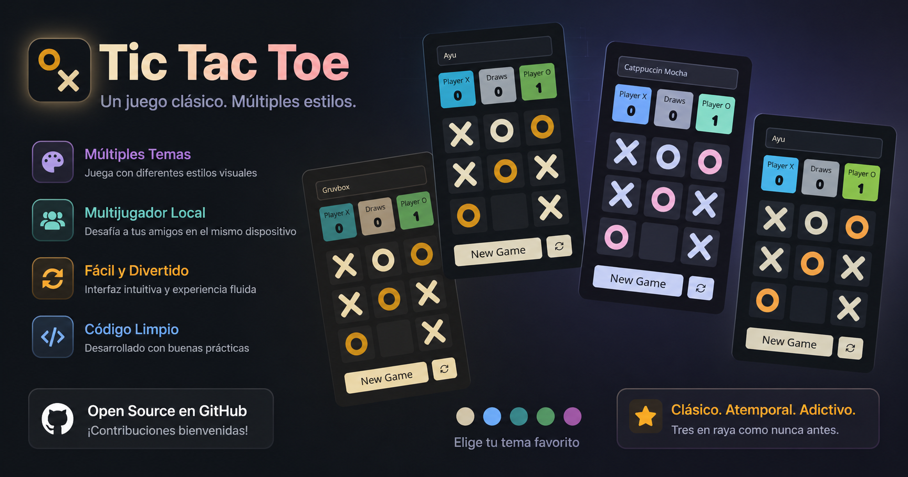

<div align="center">

# 🎮 Tic Tac Toe

**Un clásico Tic Tac Toe (Tres en raya) con un giro moderno: múltiples temas inspirados en los esquemas de color favoritos de los desarrolladores.**

[](https://react.dev/)
[](https://vitejs.dev/)
[](https://tailwindcss.com/)
[](https://github.com/ingdanieljs/tic-tac-toe/actions/workflows/deploy.yml)
[](./LICENSE)

### 🌐 [**Jugar ahora →**](https://ingdanieljs.github.io/tic-tac-toe/)

<!-- Reemplaza con una captura real del juego en public/preview.png -->


</div>

---

## ✨ Características

- 🎨 **4 temas de color** inspirados en esquemas populares de editores de código:
  - 🟫 **Gruvbox**
  - 🌅 **Ayu**
  - 🧛 **Dracula**
  - ☕ **Catppuccin Mocha**
- 💾 **Persistencia automática** en `localStorage`: continúa tu partida donde la dejaste, incluso si cierras el navegador.
- 🏆 **Marcador acumulado** de victorias para `X`, `O` y empates.
- ✨ **Animación de victoria** que resalta la combinación ganadora.
- 🔄 Botones para **iniciar nueva partida** o **reiniciar el marcador** completo.
- ⚡ Construido con **React 18 + Vite + SWC** para una experiencia ultrarrápida.
- 📱 Interfaz limpia, minimalista y totalmente responsive con **Tailwind CSS**.

---

## 🚀 Inicio rápido

```bash
# Clona el repositorio
git clone git@github.com:ingdanieljs/tic-tac-toe.git

# Entra al directorio
cd tic-tac-toe

# Instala dependencias (elige tu gestor preferido)
bun install     # o pnpm install / npm install / yarn

# Inicia el servidor de desarrollo
bun run dev     # o pnpm run dev / npm run dev
```

Abre [http://localhost:5173](http://localhost:5173) y ¡a jugar! 🎉

---

## 📜 Scripts disponibles

| Script            | Descripción                                |
| ----------------- | ------------------------------------------ |
| `bun run dev`     | Levanta el entorno de desarrollo con Vite. |
| `bun run build`   | Genera la build de producción optimizada.  |
| `bun run preview` | Previsualiza la build de producción local. |
| `bun run lint`    | Ejecuta ESLint sobre todo el proyecto.     |

---

## 🧱 Stack tecnológico

- ⚛️ **React 18.3**
- ⚡ **Vite 5** + **@vitejs/plugin-react-swc**
- 🎨 **Tailwind CSS 3.4** + **PostCSS** + **Autoprefixer**
- 🧹 **ESLint 9** con plugins para React y React Hooks

---

## 📁 Estructura del proyecto

```
tic-tac-toe/
├── public/
│   └── icons/                 # Favicons y manifest
├── src/
│   ├── App.jsx                # Componente principal y lógica del juego
│   ├── constants.js           # Turnos, combinaciones ganadoras y temas
│   ├── main.jsx               # Punto de entrada de React
│   ├── assets/styles/main.css # Estilos globales y variables de tema
│   └── components/
│       ├── Buttons.jsx        # Botones de control
│       ├── Scores.jsx         # Marcador
│       ├── Square.jsx         # Casilla del tablero
│       ├── ThemeSelector.jsx  # Selector de tema
│       └── icons/             # Íconos SVG como componentes
├── index.html
├── tailwind.config.js
├── postcss.config.js
├── vite.config.js
└── eslint.config.js
```

---

## 🎨 Cambiar de tema

Usa el selector de tema en la parte superior del tablero para alternar entre los esquemas de color disponibles. Tu elección se guarda en `localStorage`, así que se mantendrá la próxima vez que abras la app.

---

## 🚢 Despliegue en GitHub Pages

El proyecto ya viene listo para desplegarse automáticamente en **GitHub Pages** mediante GitHub Actions.

### Pasos a seguir

1. **Sube el repo a GitHub** con el nombre `tic-tac-toe` (o ajusta el `base` en [`vite.config.js`](./vite.config.js) si usas otro nombre).
2. En tu repositorio, ve a **Settings → Pages**.
3. En **Build and deployment → Source**, selecciona **GitHub Actions**.
4. Haz `push` a la rama `main`. El workflow [`.github/workflows/deploy.yml`](./.github/workflows/deploy.yml) construirá la app y la publicará automáticamente.
5. Tu sitio estará disponible en:

   ```
   https://<tu-usuario>.github.io/tic-tac-toe/
   ```

> 💡 Si despliegas en un dominio personalizado o en `<usuario>.github.io`, cambia `base: '/tic-tac-toe/'` por `base: '/'` en `vite.config.js`.

---

## 🤝 Contribuir

¿Tienes una idea para un nuevo tema o feature? ¡Las contribuciones son bienvenidas!

1. Haz fork del proyecto.
2. Crea tu rama (`git checkout -b feature/nuevo-tema`).
3. Realiza tus cambios y haz commit (`git commit -m "feat: agrega tema Tokyo Night"`).
4. Haz push a tu rama (`git push origin feature/nuevo-tema`).
5. Abre un Pull Request.

---

## 📝 Licencia

Distribuido bajo la licencia **MIT**. Consulta el archivo [LICENSE](./LICENSE) para más información.

---

<div align="center">

Hecho con ❤️ y mucho café por [**@ingdanieljs**](https://github.com/ingdanieljs)

⭐ Si te gustó el proyecto, no olvides dejar una estrella en GitHub.

</div>

